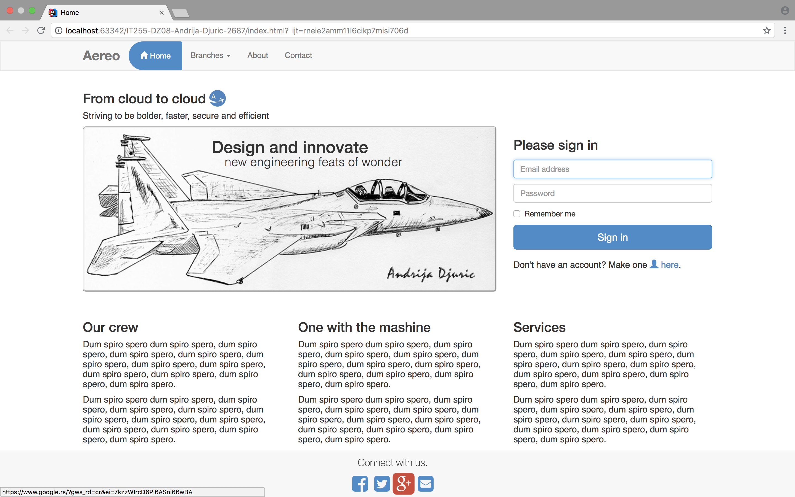
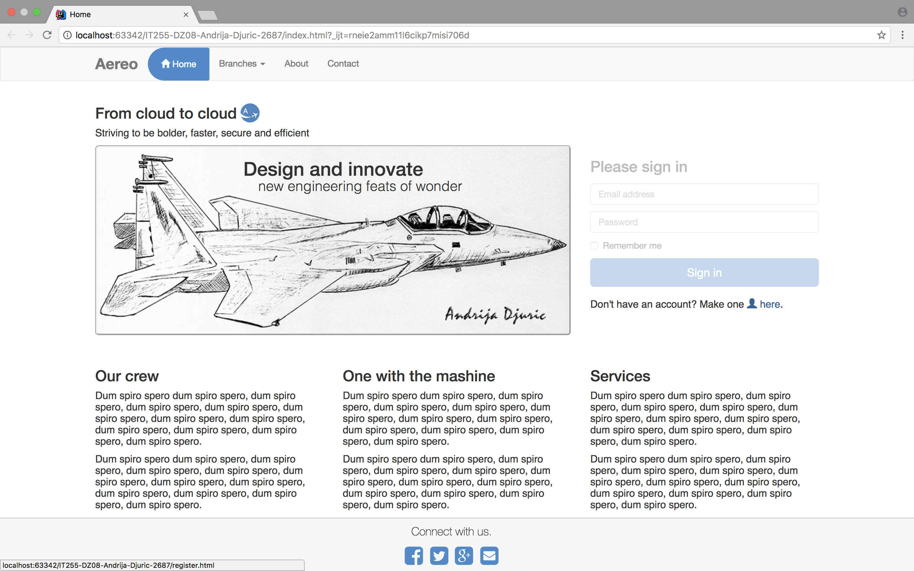
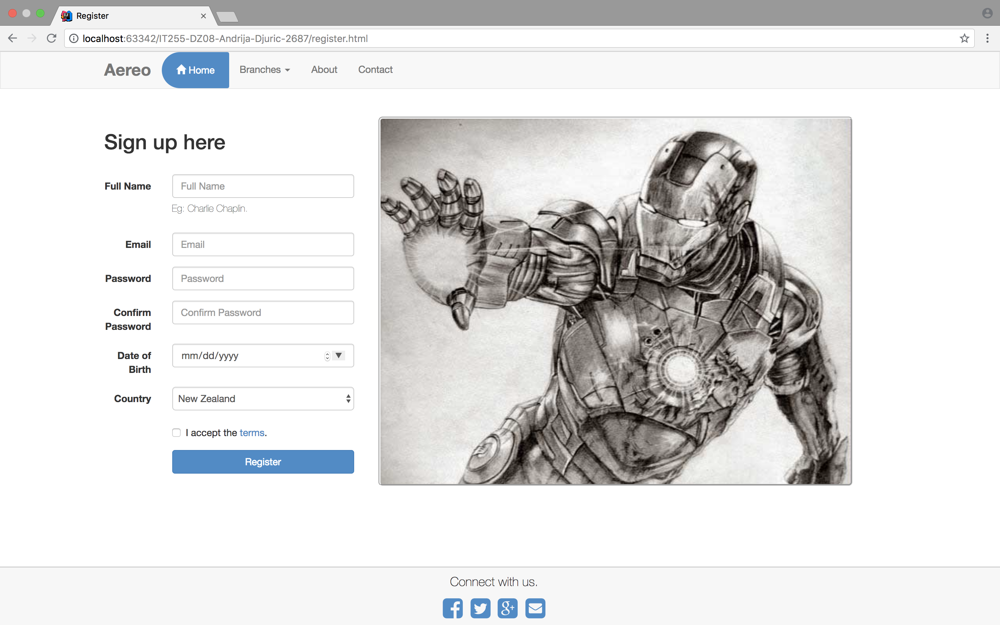
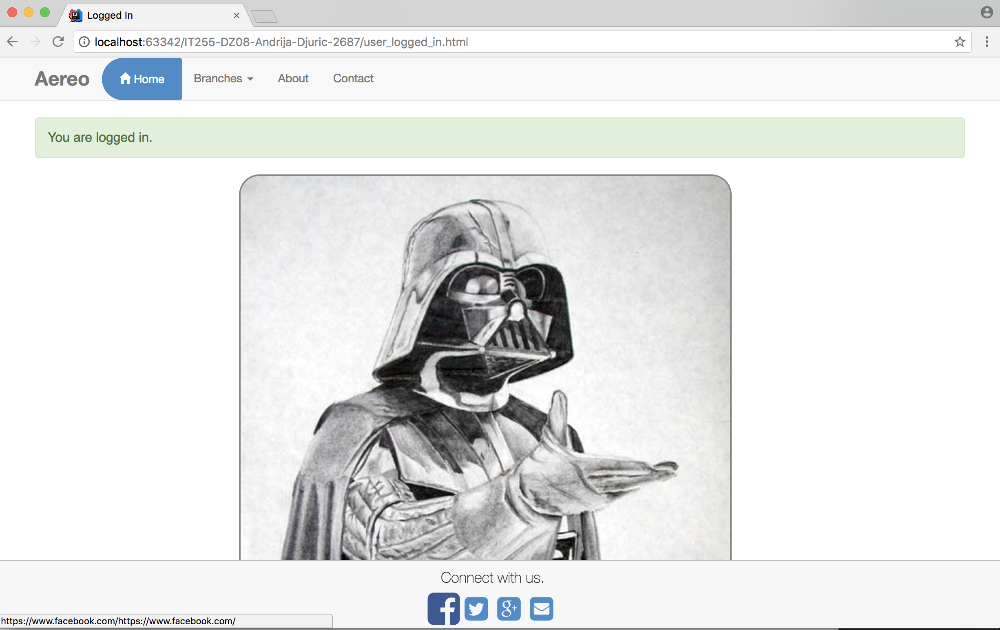
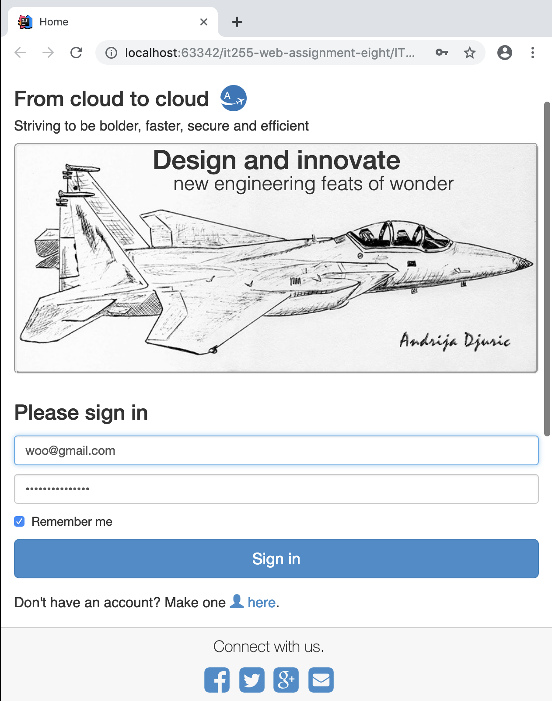

# it255-web-assignment-eight 🚦
<h3>A third year university web project. 🚥</h3>
<ul>
  <li>Made for the <b>IT255 Web Services I</b> course. 🍏</li>
  <li>This is the eighth assignment of the course. </li>
  <li>Has a simple MySQL testing database.</li>
  <li>The <b>scripts</b> (not including the JavaScript file) folder must be placed in the xampp > htdocs folder.</li>
</ul>
<h3>Project snapshots. 💻</h3>

View 1

View 2

View 3

View 4

View 5

View 6

