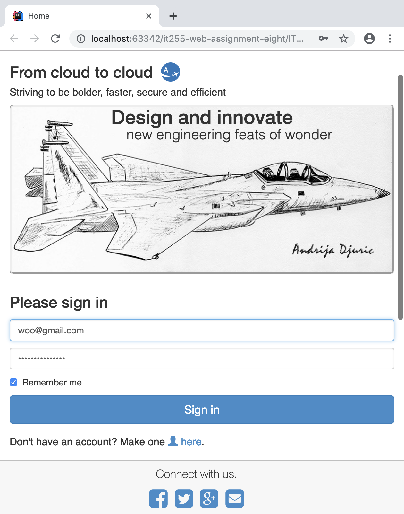

# it255-web-assignment-eight
<h3>A third year university web project.</h3>
<ul>
  <li>Made for the <b>IT255 Web Services I</b> course. 🍏</li>
  <li>This is the eighth assignment of the course.</li>
  <li>More of a <b>front end</b> project.</li>
  <li>The <b>scripts</b> (not including the JavaScript file) folder must be placed in the XAMPP > htdocs folder.</li>
  <li>Services and database are not finished.</li>
  <li>Some images are not really responsive.</li>
</ul>

#### Project snapshots: 
<h6>View 1</h6>

<h6>View 2</h6>

<h6>View 3</h6>

<h6>View 4</h6>

<h6>View 5</h6>

<h6>View 6</h6>

